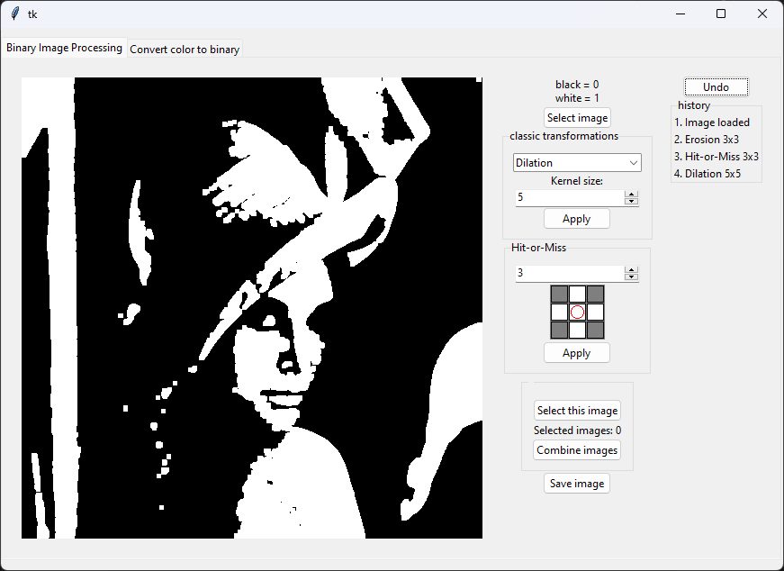
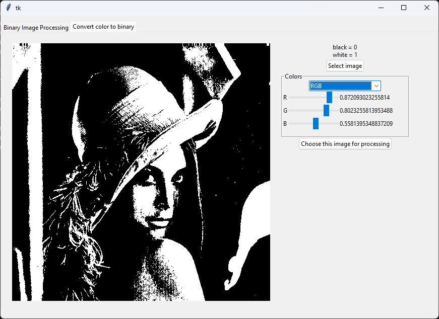

# Simple binary image processing app
Implemented functions:
- reading/writing images from/to disk
- morphological operations such as: dilation, erosion, opening and closing with different kernel sizes
- hit or miss transformation with different kernel sizes and patterns. Pattern can be chosen from the grid (gray = any value, white = 1, black=0). Red circle shows center of the gird.
- combining several processed images into one (uses OR operation)
- undo operation
- converting color images to binary images using color channels thresholds (two color spaces implemented: RGB and YCbCr)

## Usage
```bash
git clone https://github.com/KwiatkM/TEM
pip install -r requirements.txt
python app.py
```

# Examples


